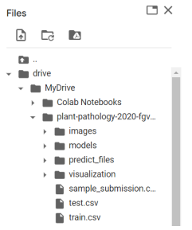

<!-- PROJECT LOGO -->
 

  

<h3 align="center">CNNs for Plant Pathology problem</h3>

  

    Using 4 different models: VGG16, DenseNet, Inception-v3, AlexNet for solving the Plant Pathology problem.
     
    <a href="https://github.com/nguyendothanhtruc/CNNs-plant-pathology-2020-fgvc7/tree/main/report"><strong>Explore the docs »</strong></a>
  

<!-- TABLE OF CONTENTS -->

  
Table of Contents

  <ol>
    <li>
      <a href="#problem-statement">Problem Statement</a>
      <ul>
        <li><a href="#built-with">Built With</a></li>
      </ul>
    </li>
    <li>
      <a href="#getting-started">Getting Started</a>
      <ul>
        <li><a href="#usage">Usage</a></li>
      </ul>
    </li>
    <li><a href="#citation">Citation</a></li>
    <li><a href="#contact">Contact</a></li>
  </ol>

<!-- ABOUT THE PROJECT -->
## Problem Statement

![Plant Diseases][plant-diseases]

[plant-diseases]: images/diseases.jpg

In agriculture, the yield of crops depends a lot on the weather, care regime, pests, etc., to increase productivity, growers need to take measures to limit the impact of these factors.

However, plants themselves also have certain diseases which are showed on o stems, leaves... the abnormal expressions on plants are often related to a certain disease.
In order to help growers identify diseases that are present in crops, we are provided with image dataset of plant diseases and diseased dataset `plant-pathology-2020-fgvc7` including `train.csv` and `test.csv`.
The dataset has 4 types: 
* healthy
* multiple_diseases
* rust
* scab

Our project is to use `Neural Networks` to classify the diseases in plants. Therefore, we use 4 different models for solving this problem.

## Model Architectures
For each model, we review some key features and the reason why we chose it for classify plant's diseases problem. For more information, please exploring [the document](https://github.com/nguyendothanhtruc/CNNs-plant-pathology-2020-fgvc7/tree/main/report).

### VGG16
![VGG16][vgg16]

[vgg16]: images/vgg16.png

### DenseNet
![DenseNet][densenet]

[densenet]: images/densenet.png

### Inception-v3
![Inception-v3][inception-v3]

[inception-v3]: images/inception-v3.png

### AlexNet
![AlexNet][alexnet]

[alexnet]: images/alexnet.png

(<a href="#top">back to top</a>)

## Built With

* [Python](https://www.python.org/)
* [Pandas](https://pandas.pydata.org/)
* [TensorFlow](https://www.tensorflow.org/)
* [Matplotlib](https://matplotlib.org/)
* [Google Colab](https://research.google.com/colaboratory/)

(<a href="#top">back to top</a>)

<!-- GETTING STARTED -->
## Getting Started

This is an example of how to run our model. To save time and leverage the GPU, we build our models in Google Colab and all the dataset along with the pretrained models is attached in `Google Drive`.

<b>See</b>: [Google Drive link](https://drive.google.com/drive/folders/1k5Y61GJeZJTlG2d78HTnWB2tcYZL9fPf?usp=sharing)
  

### Usage
Our code is used for Google Colab so all the file path direct to Google Drive folder which is the plant-pathology-2020-fgvc7 dataset.

The image below shows the example of folder structure for when running code in Google Colab:

  

plant-pathology-2020-fgvc7 folder comprises:
* images: folder contains images of training set and test set.
* models: folder contains models of 4 CNN architectures.
* predict_files: folder contains the prediction result of 4 models.
* visualization: folder contains the images visualize the loss and accuracy through each epoch for 4 models.
* sample_submission.csv: sample for submission.
* test.csv: test set.
* train.csv: training set.

(<a href="#top">back to top</a>)

<!-- CITATION -->
## Citation

If you found this project helpful, please consider citing our team.

(<a href="#top">back to top</a>)

<!-- CONTACT -->
## Contact

Nguyễn Đỗ Thanh Trúc - [Linkedin](https://www.linkedin.com/in/ndttruc/) 

Phạm Bảo Hân - [Linkedin](https://www.linkedin.com/in/b%E1%BA%A3o-h%C3%A2n-ph%E1%BA%A1m-b2a5a5211/) 

Trần Anh Túc - [Linkedin](https://www.linkedin.com/in/tuc-tran-a96441227/) 

Project Link: [https://github.com/nguyendothanhtruc/CNNs-plant-pathology-2020-fgvc7](https://github.com/nguyendothanhtruc/CNNs-plant-pathology-2020-fgvc7)

(<a href="#top">back to top</a>)
